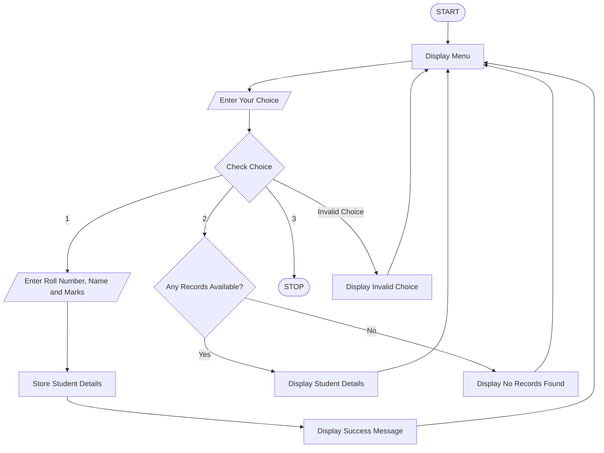

## Flowchart

```mermaid
flowchart TD
    A([START]) --> B[Display Menu]
    B --> C[/Enter Your Choice/]
    C --> D{Check Choice}

    D -->|1| E[/Enter Roll Number, Name and Marks/]
    E --> F[Store Student Details]
    F --> G[Display Success Message]
    G --> B

    D -->|2| H{Any Records Available?}
    H -->|Yes| I[Display Student Details]
    H -->|No| J[Display No Records Found]
    I --> B
    J --> B

    D -->|3| K([STOP])

    D -->|Invalid Choice| L[Display Invalid Choice]
    L --> B
```
